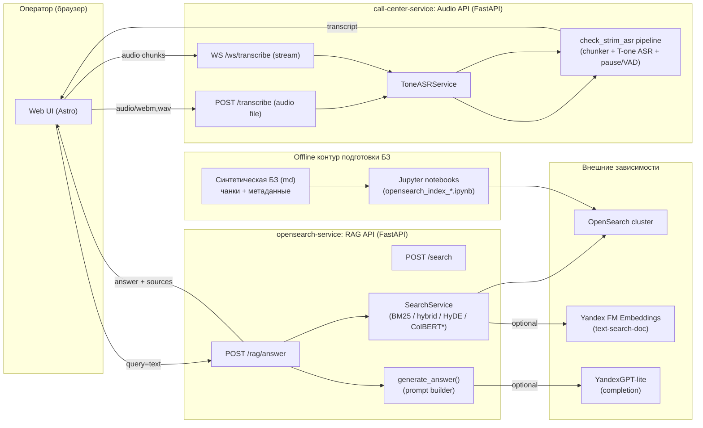

# ML System Design Doc - [RU]

## Дизайн ML системы – ASR-RAG-Realtime-Assistant, MVP, Итерация 1

---

### 1. Цели и предпосылки

#### 1.1. Зачем идем в разработку продукта?

- **Бизнес-цель**
  Сократить среднее время обработки обращения, снизить нагрузку на операторов и повысить качество ответов за счет оперативного доступа к актуальной базе знаний и лучшим практикам ответа.

- **Почему станет лучше, чем сейчас, от использования ML**
  Сейчас оператору необходимо:
  - самостоятельно формулировать запросы к базе знаний / внутренним системам;
  - вручную искать релевантные статьи и скрипты;
  - запоминать большое количество сценариев и исключений.
  Использование системы на базе ASR + RAG в real-time позволит:
  - автоматически извлекать ключевой контекст из диалога;
  - формировать запросы к базе знаний без участия оператора;
  - возвращать оператору готовые подсказки/шаблоны ответов в течение нескольких секунд.

- **Что будем считать успехом итерации с точки зрения бизнеса**
  Для пилотной итерации (MVP) успехом считаем наличие работающего прототипа со следующими компонентами:
  - развернута и протестирована модель ASR (Automatic Speech Recognition) для  решения задачи STT (Speech To Text) в режиме, близком к реальному времени
  - база знаний интегрирована в RAG (создана векторная БД, настроен поиск документов по входящему контексту и выдача топ-k релевантных)
  - подключена LLM для генерации подсказок, скорость ответа интерфейса позволяет оперативно отвечать на обращения абонентов

  Также ориентируемся на обратную связь от принимающей стороны (кураторы OZON Банка)

#### 1.2. Бизнес-требования и ограничения

- **Краткое описание бизнес-требований**
  - Подсказки должны отображаться оператору в интерфейсе с минимальной задержкой (3-5 секунд на весь пайплайн: ASR + retrieve + LLM invoke)
  - Система не должна автоматически отправлять сообщения абоненту; окончательное решение и формулировка ответа остаются за оператором.
  - Подсказки должны быть основаны на утверждённой базе знаний (регламент, скрипты, FAQ), а не на «галлюцинациях» модели.
  - Решение должно работать как минимум для входящих голосовых обращений на русском языке в рамках заданного пилотного сценария

- **Бизнес-ограничения**
  - Ограниченный бюджет и сроки на первую итерацию (MVP) → приоритет простоты решения и скорости над максимальной точностью.
  - Ввиду невозможности использования реальных корпоративных страниц (wiki/confluence) в качестве базы знаний, предлагается генерировать синтетические данные и тестироваться на них
  - По той же причине записи реальных разговоров будут взяты из открытых источников (датасеты open-stt и др.)
  - В силу отсутсвия ресурсов и возможности развернуть большие языковые модели локально, обращение к LLM будет осуществляться по API на всём этапе разработки прототипа.

#### 1.3. Что входит в скоуп проекта/итерации, что не входит

- **Входит в скоуп данной итерации (MVP)**
  - Online/near real-time распознавание речи (ASR, STT) для одного языка (русский) и заданного домена разговоров.
  - Базовый модуль intent classification для определения, когда запускать RAG-пайплайн.
  - RAG-пайплайн:
    - подготовка и индексация ограниченной базы знаний (регламенты, скрипты, FAQ);
    - поиск релевантных фрагментов/чанков (retrieval);
    - генерация краткой текстовой подсказки оператору на основе найденного контента при помощи LLM.
  - Простой интерфейс отображения подсказок оператору (прототип; допускается отдельное окно/веб-интерфейс).
  - Базовый логгинг: сохранение ключевых событий (распознанный текст, сработавший intent, выбранные документы, показанные подсказки).

- **Не входит в скоуп данной итерации**
  - Автоматическая отправка ответов абоненту без участия оператора.
  - Автоматическая маршрутизация звонков, IVR, голосовые боты.
  - Глубокая персонализация подсказок под конкретного абонента на основе истории взаимодействий.
  - Полноценная высоконагруженная продакшн-инфраструктура (multi-region, auto-scaling, 24/7 SLO и т.п.).
  - Многоязычная поддержка и поддержка разных стран/юрисдикций.

#### 1.4. Предпосылки решения

- **Технические предпосылки**
  - Существующая телефония/платформа контакт-центра позволяет получить аудиопоток в реальном времени или с минимальной задержкой.
  - Допускается развёртывание дополнительного сервиса (ASR+RAG) в инфраструктуре компании или в допустимом облаке.
  - Ожидаемая нагрузка в пилоте ограничена

- **Модели и подходы**
  - Для ASR планируется использовать существующую предобученную модель с поддержкой русского языка (облачный сервис или open-source модель).
  - Для RAG планируется использовать:
    - векторное представление документов из базы знаний;
    - быстрый поиск в многомерном пространстве (HNSW, ANN)
    - генерацию ответа/подсказки LLM-моделью, ограниченной найденным контекстом.

- **Бизнес-предпосылки**
  - Есть заинтересованный заказчик (business owner) со стороны OZON банка

---

### 2. Методология

#### 2.1. Постановка задачи

- **Тип задачи**
  - Потоковое распознавание речи (ASR, STT).
  - Классификация намерений (intent classification) и триггерных событий в диалоге.
  - Поисково-рекомендательная задача: retrieval-augmented generation (RAG) подсказок оператору на основе базы знаний.

- **Формулировка задачи в терминах ML**
  - Вход:
    - аудиопоток разговора оператор–абонент;
    - метаданные звонка (при наличии: тип обращения, линия, продукт).
  - Выход:
    - транскрипт диалога в real-time;
    - список ключевых намерений/тем диалога;
    - текстовая подсказка оператору, основанная на релевантных статьях базы знаний.

- **Цели с точки зрения качества ML-компонентов**
  - ASR: приемлемый уровень качества распознавания речи для telecom домена (конкретные значения метрик определятся по результатам тестирования)
  - RAG: достаточная релевантность подсказок для основных сценариев (оценка по экспертизе и обратной связи операторов).
  - Latency: суммарная задержка от фразы абонента до появления подсказки в пределах 5 секунд.

#### 2.2. Блок-схема решения

Блок-схема описывает высокоуровневый пайплайн для MVP (baseline может рассматриваться как упрощённый вариант без части компонентов).

1. **Получение аудио.**
   - Подключение к аудиопотоку звонка (одна или две дорожки: оператор, абонент).
   - Потоковая передача аудио в ASR-сервис.

2. **Онлайн-ASR.**
   - Разбиение аудио на фрагменты (чанки) и распознавание речи в реальном времени.
   - Формирование временных меток и атрибуция реплик (кто говорит).

3. **Intent classification / выявление триггеров**
   - Анализ текущего и предыдущих фрагментов транскрипта.
   - Определение намерения/темы запроса или триггера для запуска RAG (например, «вопрос по тарифу», «статус заявки», «техническая проблема»).

4. **Формирование запроса к базе знаний (RAG)**
   - Построение текстового запроса на основе текущего контекста диалога и распознанного интента.
   - Поиск релевантных документов/фрагментов в векторном хранилище или другой системе поиска.

5. **Генерация подсказки**
   - Формирование кандидатов подсказок на основе найденного контента:
     - краткое резюме релевантной статьи;
     - список шагов, которые должен предпринять оператор;
     - возможные уточняющие вопросы.
   - (Опционально) использование LLM для генерации финальной формулировки с ограничением контекстом найденных документов.

6. **Отображение подсказок оператору**
   - Отправка подсказки в фронтенд/виджет рабочего места оператора.
   - Обновление подсказок по мере изменения контекста диалога.

---

#### 2.3. Этапы решения задачи

##### Этап 1. Подготовка данных

**1) Данные и сущности**

Для MVP требуется несколько сущностей данных: (а) аудиодиалоги для ASR, (б) транскрипты и метки для intent/trigger, (в) база знаний (документы), (г) пары «контекст диалога → релевантные документы/правильная подсказка» для оценки RAG.

| Название данных / сущности | Есть ли данные / источник | Требуемый ресурс для получения данных | Проверено ли качество данных |
| --- | --- | --- | --- |
| Аудиозаписи разговорной речи RU (звонки/диалоги) | Публичный датасет (OpenSTT), записанные нами синтетические диалоги, также куплен 1 час датасета russian-call-center speech-ru | DS | Частично (по результатам первичной выборки/прослушивания) |
| Транскрипты (reference) для ASR-оценки | Получаем путем ручной разметки аудидорожек | DS/разметчики | Нет/частично |
| Метки intent/trigger на уровне сессии/фрагмента | Автоматическая классификация на основе продолжительных пауз | DS | Нет |
| База знаний (скрипты, FAQ, регламенты) | **Синтетическая** (LLM‑генерация + ручная валидация) | DS | Да |
| Индекс для retrieval (чанки, эмбеддинги, метаданные) | Генерируется из базы знаний | DS | Да |
| Набор тест‑кейсов для RAG | Формируется из сценариев, вручную | DS  | В процессе |

**2) Проблемы/риски по данным**

- **Доменный сдвиг в аудио**: собранные датасеты едва ли могут обеспечить репрезентативную картину реальных диалогов тех.поддержки OZON (качество связи/акценты/термины контакт‑центра) → риск деградации WER (Word Error Rate).
- **Шумы и перекрытия речи**: фоновые шумы, перебивания, crosstalk, «два спикера на одной дорожке» → риск ошибок сегментации и спикеризации.
- **Синтетическая база знаний**: вносит определенный bias, в реальности корпоративные документы, вероятно, куда более сложнее и объемнее
- **Разметка intent/trigger**: текущий подход, основанный на паузах в диалоге, вполне может выдавать FP срабатывания

**3) Процесс генерации/поступления данных**

- **Аудио**: real-time распознавание речи (в prod), на этапе тестирования используются предзаписанные диалоги, хранимые на диске.
- **База знаний**: синтетическая генерация документов, зафиксирована.
- **Intent/trigger classification**: "идем в RAG" при завершении реплики со стороны абонента, используем паузу в диалоге как явный триггер.
- **Генерация ответа**: использование API-моделей для генерации ответа на основе полученного запроса от пользователя и top-k релевантных блоков из базы данных.

**4) Конфиденциальная информация и обработка**

В публичных датасетах и синтетике не ожидается PII, однако наш пайплайн учитывает и такой вариант:

- использование open-source ASR моделек позволяет развернуть их локальнои без необходимости выходить за контур компании;
- маскирование потенциальных PII в текстах перед отправкой в LLM API, либо же переход к self-hosted моделям при расширении доступных ресурсов

---

##### Этап 2. Подготовка прогнозных моделей

Этап включает 2 ML‑компонента: **ASR** и **RAG**.

###### 2.1. Метрики и функции потерь (с обоснованием)

**ASR**

- **Основные ML‑метрики**: WER (Word Error Rate), а также latency/RTF (реальное время).
- **Loss**: В рамках MVP итерации — без обучения с нуля и fine-tune, фокус на выборе готовых решений (T-one).

**Retrieval / RAG**

- **Retrieval метрики**: Recall@k (попал ли релевантный документ в top‑k), MRR/nDCG@k (качество ранжирования).
- **Подсказка (генерация) метрики**: human eval (полезность/корректность/отсылка на источник), доля подсказок, которые противоречат базе знаний; продуктовые метрики — latency и доля запросов с пустым ответом.
- **Loss**: ограничиваемся предобученными энкодерами (mini-FRIDA) и BM25 + reranker также без дообучения.

###### 2.2. Схема ML‑валидации

В силу особенностей пайплайна, к нему могут быть применимы подходы из classic ML или timeseries. В нашем случае имеем отдельный фиксированный **query set** и gold‑разметку релевантных документов/фрагментов.

###### 2.3. Структура бейзлайна (baseline)

**Baseline цель**: получить работающий end‑to‑end прототип с минимальными рисками, пригодный для оценки latency и UX.

- **ASR**: базовая open‑source модель в batch/streaming режиме
- **Trigger**: простая классификация на основе пауз в диалогах или вообще ручной запуск RAG (если не успеваем).
- **Retrieval**: BM25 (полнотекстовый поиск) по чанкам базы знаний.
- **Подсказка**: шаблонные подсказки на основе найденного документа / быстрая и легкая API LLM с простым промптом.

###### 2.4. Структура основного MVP

- **ASR**: текущая SOTA open‑source модель для RU сегмента, только с поддержкой streaming режима
- **Intent/trigger**: классификация на основе пауз в диалогах  / использование легковесной  BERT-like модели для n-граммной классификации интентов
- **Retrieval**:
  - semantic similarity search + BM25 + RRF. Быстрый поиск по векторный БД + reranker (cross‑encoder) для top‑k;
  - чанкинг с метаданными (тип документа, продукт).
- **Подсказка (LLM)**:
  - детальная проработка промпта для генерации краткого ответа / уточняющих вопросов исключительно на основе контекста;
  - строгие ограничения на “галлюцинации”: если источников недостаточно, подсказка должна содержать безопасный fallback.

###### 2.5. Стратегии дальнейшего развития

- **Данные**: сбор более доменных аудио, покрытие большего числа сценариев.
- **ASR**: адаптация под домен (дообучение при наличии данных).
- **Retrieval**: переход от Vanila RAG к Multi-Query или Agentic RAG подходам
- **Оптимизация**: ускорение инференса, кэширование, батчинг чанков, оптимизация промптов.

###### 2.6. Анализ/интерпретация

- Ошибки ASR: анализ WER для сложных кейсов
- Ошибки intent: анализ матрицы ошибок и “ложных триггеров” (лишние подсказки)
- Ошибки RAG: не найден документ / найден нерелевантный / галлюцинации в ответ или несоответсвие стилю

###### 2.7. Риски этапа и снижение рисков

- **Latency выше SLA**: упрощение пайплайна (не используем reranker, берем меньший k), кэширование, стриминг‑обновления
- **Галлюцинации**: переход к более мощной модели, улучшение промпта
- **Низкое качество класссификиции интента**: добавление правил-эвристик + переобучеение модели на лучшей разметке, подбор порогов

**Необходимый результат этапа**

- Зафиксированный baseline и MVP‑конфигурации (описание, параметры, метрики).
- Отчет с оффлайн‑метриками (ASR / intent / retrieval) + human‑eval для подсказок.

---

##### Этап 3. Подготовка к оценке RAG и процесса human‑eval

**Зачем**: для RAG‑подсказок автоматических метрик недостаточно; нужен воспроизводимый контур оценки полезности/корректности.

- Формируем набор тест‑кейсов: “контекст диалога/вопрос → ожидаемые источники → ожидаемые элементы подсказки”.
- Описываем шкалы оценки: полезность (1–5), корректность, соответствие источникам, безопасность.
- Организуем процесс двойной разметки и измеряем согласованность (например, доля совпадений/κ).

**Результат**: версионированный eval‑набор + инструкция по оценке + baseline/MVP результаты.

---

##### Этап 4. Подготовка real‑time инференса и оптимизация задержек

- Выбор стратегии стриминга: размер аудио‑чанка, частота обновления транскрипта.
- Бюджет задержки по компонентам (ASR / intent / retrieve / LLM / UI).
- Fail‑safe режимы: деградация качества при недоступности LLM (выдать найденные статьи/шаблонные подсказки).

**Результат**: измеренная latency end‑to‑end, зафиксированные SLO для MVP, список оптимизаций.

---

##### Этап 5. Мониторинг и контур улучшения

- Схема логов/метрик: latency per stage, доля показов подсказок, acceptance‑сигналы (оператор использовал/игнорировал), ошибки RAG.
- Минимальный процесс обратной связи: “плохая подсказка” → причина (ASR/intent/retrieval/LLM) → задача на улучшение.
- Контроль безопасности: маскирование PII, аудит запросов в LLM, хранение API ключей.

**Результат**: минимальный контур мониторинга + требования к данным для следующей итерации.

---

### 3. Подготовка пилота

#### 3.1. Способ оценки пилота

Пилот — демонстрация end-to-end работы MVP на фиксированном наборе сценариев (10–15 заранее подготовленных звонков/запросов + 2–3 live-эмуляции). Оценка смешанная:
- **Онлайн-дэмо**: live-прогон 2–3 сценариев с фиксацией latency и качества подсказок; ответственные PO + DS.
- **Оффлайн-оценка**: прогон на заранее подготовленном наборе аудио/текстовых запросов (тот же eval-набор, что в RAG-оценке), сбор метрик latency, recall@k и human-eval (2 эксперта ставят баллы 1–5); ответственные DS + AB Group.
- **Архитектурный разбор**: короткий walkthrough по схеме (ASR → intent/trigger → RAG → LLM), фиксация конфигураций и ограничений; ответственный DS.

#### 3.2. Что считаем успешным пилотом

Проект по своей сути не предполагал дизайн А/B экспериментов по той причине, что сама система далека от потенциального внедрения в продакшн. Задача по оценке пилота в терминах каких-либо метрик также не ставилась со стороны заказчиков (OZON Банк). Важно было показать работающий прототип без четкого SLA и требований к UI. **Но дабы не получить 0 баллов за дз, возьму для примера следующее:**

**Primary**: полезность подсказок (human-eval, средний балл ≥ 3.5/5), доля релевантных источников в ответе (recall@5 ≥ 0.7).
**Secondary**: end-to-end latency p95 ≤ 5 c (ASR + retrieve + LLM), доля пустых подсказок ≤ 20%.

**Guardrails**: противоречия базе знаний ≤ 5% кейсов; критические опасные галлюцинации (платежи/безопасность) = 0.

**Критерий успеха пилота**: выполняются Primary и Guardrails, Secondary не хуже целевых более чем на 20%. PO фиксирует go/no-go на следующую итерацию.

**Остановка/откат во время дэмо**:
- LLM недоступен → перейти в fallback (показываем только найденные документы) или прервать показ.
- Latency > 8 c в двух подряд прогонах → отключить ColBERT/сократить k и повторить; если не помогает — стоп.
- Обнаружены галлюцинации в критичных темах → остановить live-часть, перейти к оффлайн-показу логов.

#### 3.3. Подготовка пилота

- **Данные и стенд**: фиксируем eval-набор (10–15 звонков, 30–40 текстовых запросов); индекс OpenSearch собран из синтетической БЗ, kNN включён; health чек `/health` для ASR и RAG зелёный. Прогоняем аудио заранее, сохраняем транскрипты и найденные документы для сравнения в демо.
- **Модели и версии**: ASR — T-one (check_strim_asr, конфиг `configs/default.yaml`, фиксируем commit), Yandex embeddings `text-search-doc`, ColBERT включён; LLM — YandexGPT-lite, temperature=0.1, max_tokens=300. Сохраняем commit hash и .env (без секретов) + параметры (size, use_hyde/use_colbert).
- **Вычисления и бюджет**: RPS низкий (demo); ограничиваем max_tokens=300, size<=5, всего ≤ 100 вызовов LLM на дэмо. Fallback при исчерпании квоты — выводим только retrieved документы.
- **SLA пилота**: latency p95 ≤ 5 c, доступность сервисов ≥ 99% на время дэмо; fallback при сбоях LLM/ASR (отдать документы или транскрипт без саммари).
- **Интеграция и UX**: в UI показываем подсказку + источники (файл и chunk_id) + latency; кнопка “полезно/неполезно” для human-eval (оценщики: PO и DS/AB).
- **Риски и смягчение**: низкое качество ASR → прогонять заранее, держать готовые транскрипты; нерелевантный retrieval → fallback BM25-only (disable ColBERT, уменьшить k); галлюцинации → строгий промпт, ограничение токенов, ручная проверка 3 ключевых сценариев; задержки → отключить reranker, уменьшить size, сократить max_tokens.
- **Отчёт и решение**: таблица по сценариям (полезность, recall@5, latency p50/p95, ошибки) + логи. Решение о следующей итерации принимает PO по критериям из 3.2.

---

### 4. Внедрение (контур MVP-пилота)

> В текущем репозитории уже реализованы отдельные сервисы (ASR и RAG) и фронтенд.

#### 4.1. Архитектура решения

\* ColBERT/HyDE — опциональные улучшения качества, включаются флагами запроса и наличием креденшелов/ресурсов.

**Назначение компонентов:**
- **UI** (`itmo-call-center-assistant.github.io`): запись/загрузка аудио, запрос ASR, отправка транскрипта в RAG, показ ответа + источников.
- **Audio API** (`call-center-service/scripts/api/audio_api.py`): HTTP/WS интерфейс для STT, инкапсулирует локальный ASR пайплайн.
- **check_strim_asr**: библиотека/пайплайн streaming ASR (T-one) + детектор пауз (VAD/phrase/hybrid) + (опционально) summary.
- **RAG API** (`opensearch-service/scripts/api/main_simple.py`): поиск по индексу + генерация ответа (LLM) на основе найденных чанков.
- **OpenSearch**: хранение индекса и быстрый поиск (BM25 / kNN / hybrid), масштабируется отдельно от API.

#### 4.2. Описание инфраструктуры и масштабируемости

**MVP-пилот (самый простой контур):**
- **1 VM** (Linux) + `docker-compose`:
  - `frontend` (astro)
  - `audio-service` (FastAPI/uvicorn, CPU)
  - `rag-api` (FastAPI/uvicorn)
  - `opensearch` (single-node) + persistent volume
- **Секреты**: `.env` (для пилота) → в проде заменить на Secret Manager (Vault / KMS / cloud secrets).

**Как масштабируем:**
- **RAG API**: горизонтально (N replicas) за счёт stateless‑логики; ограничивающий фактор — OpenSearch и LLM API quota.
- **Audio API**: горизонтально (N replicas) или через очередь задач; ограничивающий фактор — CPU/GPU на ASR.
- **OpenSearch**: scale-out (шардинг + реплики) и/или увеличение ресурсов (RAM/CPU/SSD).

#### 4.3. Требования к работе системы (SLA/SLO)

**SLO по задержке (MVP):**
- **end-to-end p95 ≤ 5 c** от окончания реплики клиента до появления подсказки в UI.
- Рекомендуемый budget по стадиям:
  - ASR (локально): p95 ≤ 2.5 c на реплику (зависит от длины аудио)
  - Retrieval (OpenSearch): p95 ≤ 0.5 c
  - LLM completion: p95 ≤ 1.5–2.0 c при `max_tokens ≤ 300`
  - UI/network overhead: ≤ 0.2–0.3 c

**Надёжность:**
- Доступность сервисов на время пилота: **≥ 99%** (best-effort).
- Fallback‑режимы:
  - LLM недоступен → показываем только найденные документы + шаблон ответа
  - OpenSearch недоступен → показываем “не найдено” и просим уточнить запрос
  - ASR недоступен → ручной ввод текста в UI

**Пропускная способность (ориентиры пилота):**
- 5–20 операторов, 1–2 запроса в минуту на оператора в пике.
- Целевая устойчивость: **~1–5 RPS** на RAG контур и **~0.5–2 RPS** на ASR контур (с запасом).

#### 4.4. Безопасность системы

**Потенциальные уязвимости и меры:**
- **Нет аутентификации** в текущих FastAPI сервисах → добавить API‑ключи/JWT + mTLS внутри контура.
- **CORS allow\_origins="*"** → в проде ограничить доменом фронтенда.
- **Rate limiting**: защитить `/rag/answer` и `/transcribe` от DoS (например, nginx/ingress + token bucket).
- **TLS**: только HTTPS для внешнего трафика; внутри контура — mTLS (по возможности).
- **Secrets**: убрать `.env` из runtime, использовать Secret Manager + ротацию ключей.

#### 4.5. Безопасность данных

- Потенциально аудио/транскрипты могут содержать PII → логировать минимально, добавить маскирование (телефон, паспорт, карты) перед отправкой в LLM.
- Retention: хранить логи/транскрипты ограниченно (например, 7–30 дней) и по согласованной политике.
- Доступ: RBAC к OpenSearch/логам; аудит доступа.

#### 4.6. Integration points

**UI → Audio API (`:8001`)**
- `GET /health`
- `POST /transcribe` (multipart form-data, поле `file`)
- `WS /ws/transcribe` (байты аудио чанков)

**UI → RAG API (`:8000`)**
- `GET /health`
- `POST /rag/answer` (JSON: `query`, `size`, `index_name`, `use_hyde`, `use_colbert`)
- `POST /search`

#### 4.7. Нагрузочное тестирование (результаты)

**Цель:** измерить пропускную способность и latency HTTP‑API при конкурентной нагрузке.

Не проводилось (
