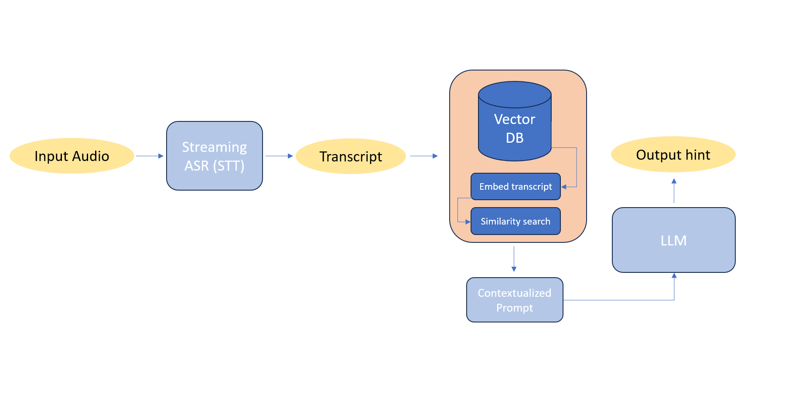

# ML System Design Doc - [RU]

## Дизайн ML системы – ASR-RAG-Realtime-Assistant, MVP, Итерация 1

---

### 1. Цели и предпосылки

#### 1.1. Зачем идем в разработку продукта?

- **Бизнес-цель**
  Сократить среднее время обработки обращения, снизить нагрузку на операторов и повысить качество ответов за счет оперативного доступа к актуальной базе знаний и лучшим практикам ответа.

- **Почему станет лучше, чем сейчас, от использования ML**
  Сейчас оператору необходимо:
  - самостоятельно формулировать запросы к базе знаний / внутренним системам;
  - вручную искать релевантные статьи и скрипты;
  - запоминать большое количество сценариев и исключений.
  Использование системы на базе ASR + RAG в real-time позволит:
  - автоматически извлекать ключевой контекст из диалога;
  - формировать запросы к базе знаний без участия оператора;
  - возвращать оператору готовые подсказки/шаблоны ответов в течение нескольких секунд.

- **Что будем считать успехом итерации с точки зрения бизнеса**
  Для пилотной итерации (MVP) успехом считаем наличие работающего прототипа со следующими компонентами:
  - развернута и протестирована модель ASR (Automatic Speech Recognition) для  решения задачи STT (Speech To Text) в режиме, близком к реальному времени
  - база знаний интегрирована в RAG (создана векторная БД, настроен поиск документов по входящему контексту и выдача топ-k релевантных)
  - подключена LLM для генерации подсказок, скорость ответа интерфейса позволяет оперативно отвечать на обращения абонентов

  Также ориентируемся на обратную связь от принимающей стороны (кураторы OZON Банка)

#### 1.2. Бизнес-требования и ограничения

- **Краткое описание бизнес-требований**
  - Подсказки должны отображаться оператору в интерфейсе с минимальной задержкой (3-5 секунд на весь пайплайн: ASR + retrieve + LLM invoke)
  - Система не должна автоматически отправлять сообщения абоненту; окончательное решение и формулировка ответа остаются за оператором.
  - Подсказки должны быть основаны на утверждённой базе знаний (регламент, скрипты, FAQ), а не на «галлюцинациях» модели.
  - Решение должно работать как минимум для входящих голосовых обращений на русском языке в рамках заданного пилотного сценария

- **Бизнес-ограничения**
  - Ограниченный бюджет и сроки на первую итерацию (MVP) → приоритет простоты решения и скорости над максимальной точностью.
  - Ввиду невозможности использования реальных корпоративных страниц (wiki/confluence) в качестве базы знаний, предлагается генерировать синтетические данные и тестироваться на них
  - По той же причине записи реальных разговоров будут взяты из открытых источников (датасеты open-stt и др.)
  - В силу отсутсвия ресурсов и возможности развернуть большие языковые модели локально, обращение к LLM будет осуществляться по API на всём этапе разработки прототипа.

#### 1.3. Что входит в скоуп проекта/итерации, что не входит

- **Входит в скоуп данной итерации (MVP)**
  - Online/near real-time распознавание речи (ASR, STT) для одного языка (русский) и заданного домена разговоров.
  - Базовый модуль intent classification для определения, когда запускать RAG-пайплайн.
  - RAG-пайплайн:
    - подготовка и индексация ограниченной базы знаний (регламенты, скрипты, FAQ);
    - поиск релевантных фрагментов/чанков (retrieval);
    - генерация краткой текстовой подсказки оператору на основе найденного контента при помощи LLM.
  - Простой интерфейс отображения подсказок оператору (прототип; допускается отдельное окно/веб-интерфейс).
  - Базовый логгинг: сохранение ключевых событий (распознанный текст, сработавший intent, выбранные документы, показанные подсказки).

- **Не входит в скоуп данной итерации**
  - Автоматическая отправка ответов абоненту без участия оператора.
  - Автоматическая маршрутизация звонков, IVR, голосовые боты.
  - Глубокая персонализация подсказок под конкретного абонента на основе истории взаимодействий.
  - Полноценная высоконагруженная продакшн-инфраструктура (multi-region, auto-scaling, 24/7 SLO и т.п.).
  - Многоязычная поддержка и поддержка разных стран/юрисдикций.

#### 1.4. Предпосылки решения

- **Технические предпосылки**
  - Существующая телефония/платформа контакт-центра позволяет получить аудиопоток в реальном времени или с минимальной задержкой.
  - Допускается развёртывание дополнительного сервиса (ASR+RAG) в инфраструктуре компании или в допустимом облаке.
  - Ожидаемая нагрузка в пилоте ограничена

- **Модели и подходы**
  - Для ASR планируется использовать существующую предобученную модель с поддержкой русского языка (облачный сервис или open-source модель).
  - Для RAG планируется использовать:
    - векторное представление документов из базы знаний;
    - быстрый поиск в многомерном пространстве (HNSW, ANN)
    - генерацию ответа/подсказки LLM-моделью, ограниченной найденным контекстом.

- **Бизнес-предпосылки**
  - Есть заинтересованный заказчик (business owner) со стороны OZON банка

---

#### 2.1. Постановка задачи

- **Тип задачи**
  - Потоковое распознавание речи (ASR, STT).
  - Классификация намерений (intent classification) и триггерных событий в диалоге.
  - Поисково-рекомендательная задача: retrieval-augmented generation (RAG) подсказок оператору на основе базы знаний.

- **Формулировка задачи в терминах ML**
  - Вход:
    - аудиопоток разговора оператор–абонент;
    - метаданные звонка (при наличии: тип обращения, линия, продукт).
  - Выход:
    - транскрипт диалога в real-time;
    - список ключевых намерений/тем диалога;
    - текстовая подсказка оператору, основанная на релевантных статьях базы знаний.

- **Цели с точки зрения качества ML-компонентов**
  - ASR: приемлемый уровень качества распознавания речи для telecom домена (конкретные значения метрик определятся по результатам тестирования)
  - RAG: достаточная релевантность подсказок для основных сценариев (оценка по экспертизе и обратной связи операторов).
  - Latency: суммарная задержка от фразы абонента до появления подсказки в пределах 5 секунд.

#### 2.2. Блок-схема решения

Блок-схема описывает высокоуровневый пайплайн для MVP (baseline может рассматриваться как упрощённый вариант без части компонентов).

1. **Получение аудио.**
   - Подключение к аудиопотоку звонка (одна или две дорожки: оператор, абонент).
   - Потоковая передача аудио в ASR-сервис.

2. **Онлайн-ASR.**
   - Разбиение аудио на фрагменты (чанки) и распознавание речи в реальном времени.
   - Формирование временных меток и атрибуция реплик (кто говорит).

3. **Intent classification / выявление триггеров** (на схеме не отражен)
   - Анализ текущего и предыдущих фрагментов транскрипта.
   - Определение намерения/темы запроса или триггера для запуска RAG (например, «вопрос по тарифу», «статус заявки», «техническая проблема»).

4. **Формирование запроса к базе знаний (RAG)**
   - Построение текстового запроса на основе текущего контекста диалога и распознанного интента.
   - Поиск релевантных документов/фрагментов в векторном хранилище или другой системе поиска.

5. **Генерация подсказки**
   - Формирование подсказок с использование LLM для генерации финальной формулировки по контексту найденных документов.

6. **Отображение подсказок оператору**
   - Отправка подсказки в фронтенд/виджет рабочего места оператора.
   - Обновление подсказок по мере изменения контекста диалога.

---
